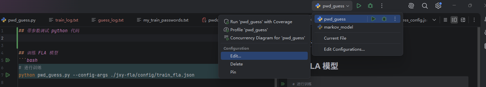
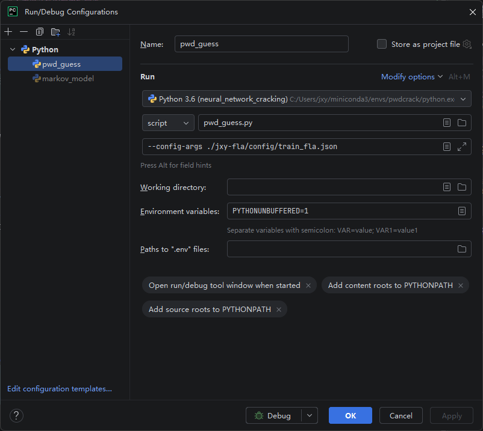
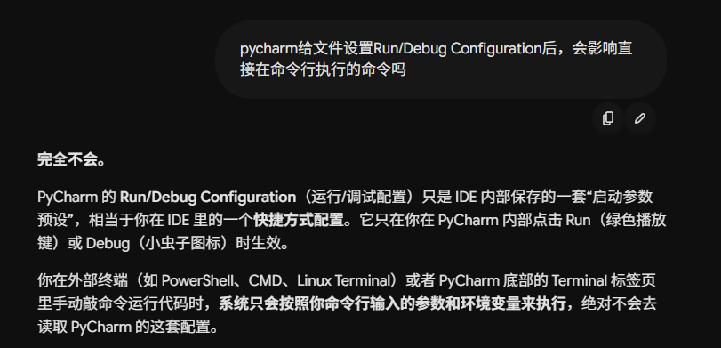
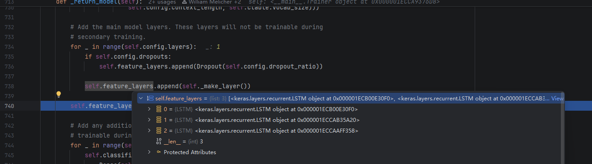
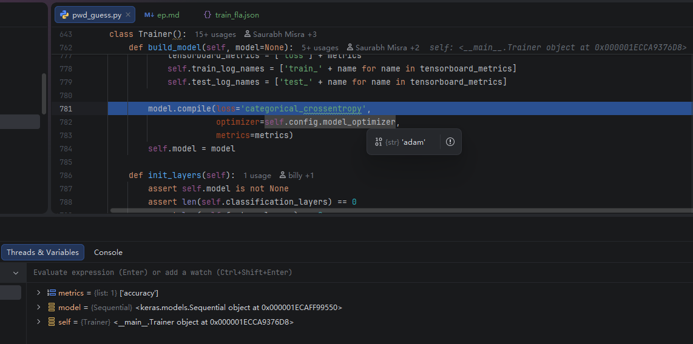
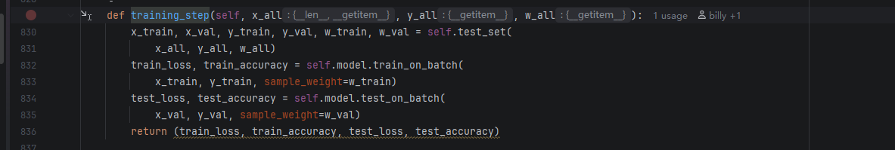
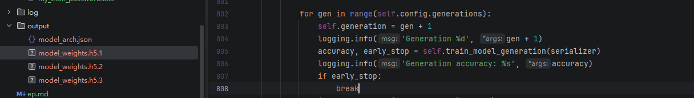
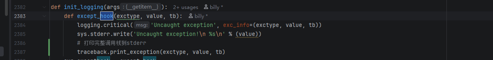
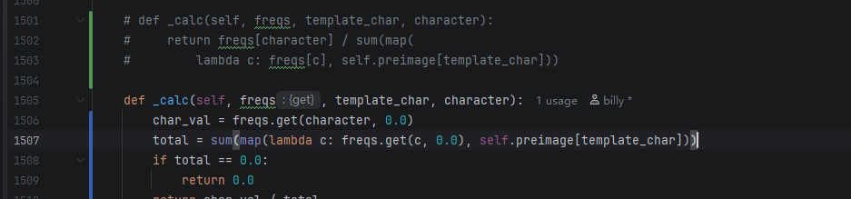

## 带参数调试 python 代码
### 进入当前文件的配置编辑器

### 设置配置

### 然后打断点，点击 虫子 图标即可调试，设置的配置并不影响接下来在命令行里面输入的命令，因为设置配置本质是对当前命令的更改

## 训练 FLA 模型
```bash
# 进行训练
python pwd_guess.py --config-args ./jxy-fla/config/train_fla.json

```
看起来是 3 层的 LSTM,调试的关键参数是 Trainer() 类的 model 参数



Trainer()类里面有 build_model()和train_model(),
build_model()使用的是 keras 库，通过配置参数构建模型。
Trainer类 导入的是模型配置和训练数据，模型配置负责 build_model()，build_model()仅仅负责构建模型，
并没有相关训练数据的参数，train_model()才把训练数据使用起来。要接受这些设计模式或者分层的思想。

### 训练的时候使用了 build_model() 构建的模型


### 为什么会产生3个权重（训练好的模型），与 self.config.generations 这个参数有关 accuracy 这个参数好像就是损失之类的


## 开始枚举
### 激活环境
```bash
& "C:\Users\jxy\miniconda3\shell\condabin\conda-hook.ps1"

conda activate pwdcrack
```
### 枚举
```bash
python pwd_guess.py --config-args ./jxy-fla/config/guess_config.json
```
### 面对出现的问题，对代码进行了一下优化：
#### 不影响代码逻辑的优化：
输出详细的报错信息，方便追踪错误。

#### 影响的操作
当训练集的数据不充分时，就会报这样的错误：
对应字符不在训练集的统计里面。因此更改代码，防止 /0
