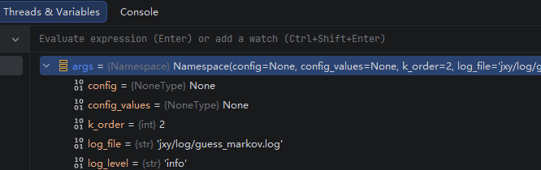
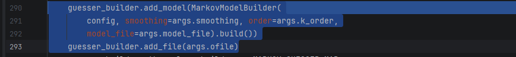

PASSWORD_END = '\n'
PASSWORD_START = '\t'
## 训练 markov
训练 markov 模型的命令 -1
```bash
python markov_model.py -t jxy/input/my_train_passwords_markov.txt -o jxy/output/markov_model_k5.json -k 5 -s none -f tsv
```
阶数是 5 是指使用前 4 个预测下一个

结果
```bash
(pwdcrack) C:\Users\jxyjxy\Desktop\models-origin\neural_network_cracking>python markov_model.py -t jxy/input/my_train_passwords_markov.txt -o jxy/output/markov_model_k5.json -k 5 -s none -f tsv
Using TensorFlow backend.
Using keras version 2.1.3
2026-07-17 16:05:58,780 INFO: Beginning...
2026-07-17 16:05:58,780 INFO: Arguments: {
    "train_file": "jxy/input/my_train_passwords_markov.txt",
    "ofile": "jxy/output/markov_model_k5.json",
    "model_file": null,
    "password_file": null,
    "k_order": 5,
    "config": null,
    "smoothing": "none",
    "train_format": "tsv",
    "config_values": null,
    "log_file": null,
    "log_level": "info"
}
2026-07-17 16:05:58,822 INFO: Version: 36c8345f6526b1428836495800c7a00f1ed7aad7
2026-07-17 16:05:58,822 INFO: Beginning training of 5-gram model...
2026-07-17 16:05:58,822 INFO: Using default config
2026-07-17 16:05:58,822 INFO: Using config: {
    "char_bag": "abcdefghijklmnopqrstuvwxyzABCDEFGHIJKLMNOPQRSTUVWXYZ0123456789~!@#$%^&*(),.<>/?'\"{}[]\\|-_=+;: `\n",
    "model_type": "LSTM",
    "sequence_model": 0,
    "hidden_size": 128,
    "layers": 1,
    "max_len": 40,
    "min_len": 4,
    "training_chunk": 128,
    "generations": 20,
    "chunk_print_interval": 1000,
    "lower_probability_threshold": 1e-05,
    "relevel_not_matching_passwords": true,
    "training_accuracy_threshold": -1.0,
    "train_test_ratio": 10,
    "rare_character_optimization": false,
    "rare_character_optimization_guessing": false,
    "uppercase_character_optimization": false,
    "rare_character_lowest_threshold": 20,
    "guess_serialization_method": "human",
    "simulated_frequency_optimization": true,
    "intermediate_fname": ":memory:",
    "save_always": true,
    "save_model_versioned": false,
    "randomize_training_order": true,
    "model_optimizer": "adam",
    "guesser_intermediate_directory": "guesser_files",
    "cleanup_guesser_files": true,
    "early_stopping": false,
    "early_stopping_patience": 10000,
    "compute_stats": false,
    "password_test_fname": "",
    "chunk_size_guesser": 1000,
    "random_walk_seed_num": 1000,
    "max_gpu_prediction_size": 25000,
    "cpu_limit": 8,
    "random_walk_confidence_bound_z_value": 1.96,
    "random_walk_confidence_percent": 5,
    "random_walk_upper_bound": 10,
    "no_end_word_cache": false,
    "enforced_policy": "basic",
    "pwd_list_weights": {},
    "dropouts": false,
    "dropout_ratio": 0.25,
    "tensorboard": false,
    "tensorboard_dir": ".",
    "context_length": 40,
    "train_backwards": false,
    "dense_layers": 0,
    "dense_hidden_size": 128,
    "secondary_training": false,
    "secondary_train_sets": {},
    "training_main_memory_chunksize": 1000000,
    "probability_steps": false,
    "freeze_feature_layers_during_secondary_training": true,
    "secondary_training_save_freqs": false,
    "guessing_secondary_training": false,
    "guesser_class": "markov_human",
    "freq_format": "hex",
    "padding_character": false,
    "convolutional_kernel_size": 3,
    "embedding_layer": false,
    "embedding_size": 8,
    "previous_probability_mapping_file": null,
    "probability_calculator_cache_size": 0,
    "additive_smoothing_amount": 0,
    "backoff_smoothing_threshold": 10
}
2026-07-17 16:05:58,824 INFO: Saving model to jxy/output/markov_model_k5.json
```
***
训练 markov 模型的命令 -2
```bash
python markov_model.py -t jxy/input/my_train_passwords_markov.txt -o jxy/output/markov_model_k2.json -k 2 -s none -f tsv -l jxy/log/train_markov.log
```
结果
```bash
(pwdcrack) C:\Users\jxyjxy\Desktop\models-origin\neural_network_cracking>python markov_model.py -t jxy/input/my_train_passwords_markov.txt -o jxy/output/markov_model_k2.json -k 2 -s none -f tsv -l jxy/log/train_markov.log
Using TensorFlow backend.
Using keras version 2.1.3
```
***

## 使用 markov 进行猜测
命令
```bash
# 下面的命令没有指定 -k 参数，使得默认的 -k == 2
python markov_model.py -m jxy/output/markov_model_k5.json -o jxy/output/markov_guesses_k5.txt -l jxy/log/guess_markov.log
python markov_model.py -m jxy/output/markov_model_k2.json -o jxy/output/markov_guesses_k2.txt -l jxy/log/guess_markov.log
```

下面的猜测需要用到 k 这个参数

结果
```bash
(pwdcrack) C:\Users\jxyjxy\Desktop\models-origin\neural_network_cracking>python markov_model.py -m jxy/output/markov_model_k5.json -o jxy/output/markov_guesses_k5.txt -l jxy/log/guess_markov.log
Using TensorFlow backend.
Using keras version 2.1.3
markov_model.py:43: RuntimeWarning: invalid value encountered in double_scalars
  answer[i] /= total_sum
C:\Users\jxyjxy\Desktop\models-origin\neural_network_cracking\pwd_guess.py:1870: RuntimeWarning: invalid value encountered in greater_equal
  above_cutoff = total_preds >= self.lower_probability_threshold
```
```bash
(pwdcrack) C:\Users\jxyjxy\Desktop\models-origin\neural_network_cracking>python markov_model.py -m jxy/output/markov_model_k2.json -o jxy/output/markov_guesses_k2.txt -l jxy/log/guess_markov.log
Using TensorFlow backend.
Using keras version 2.1.3
```
合理的命令，见下
```bash
python markov_model.py -m jxy/output/markov_model_k5.json -o jxy/output/model_k5_markov_guesses_k5.txt -k 5 -l jxy/log/guess_markov.log
python markov_model.py -m jxy/output/markov_model_k2.json -o jxy/output/model_k2_markov_guesses_k2.txt -k 2 -l jxy/log/guess_markov.log
```